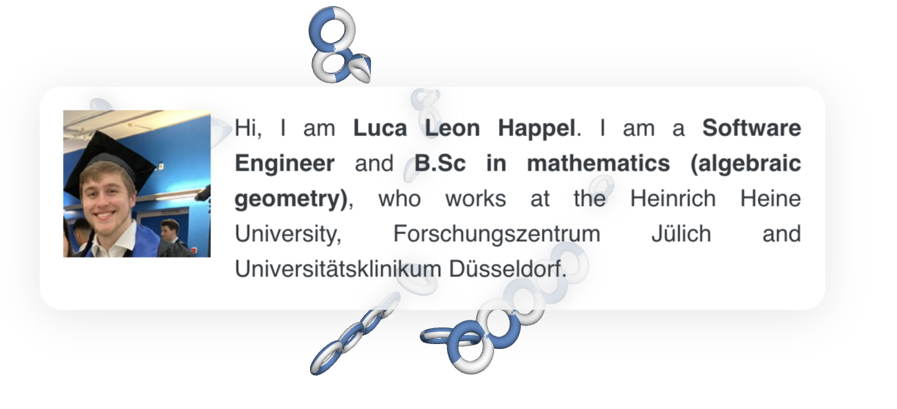

### Hi, I'm Luca Leon Happel

Mathematician | Data Scientist | Type Theory Enjoyer | Programmer

I work at universities and hospitals across Germany, doing research in topology and algebra, building data-driven systems, and writing open-source tools. I hold a B.Sc. in Mathematics from Heinrich Heine University Dusseldorf.

---

**[happel.ai](https://happel.ai)** -- my blog: math, CS, security research, and more

**[Consultation](https://happel.ai/consultation.html)** -- I offer consultation services and am always happy to help out if anyone needs me. Feel free to reach out!

---

 

 

 

 

 

---

This and more on my [blog](https://happel.ai).

**Get in touch:** Visit my [blog](https://happel.ai) -- Book a [consultation](https://happel.ai/consultation.html) -- Find me on [LinkedIn](https://www.linkedin.com/in/luca-happel-56607925a/)

